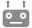

# Waldo Commander

A web interface for controlling robotic arms, currently tested with the [PAROL6](https://github.com/PCrnjak/PAROL6-Desktop-robot-arm) robot.

<video controls width="100%">
  <source src="https://github.com/Jepson2k/Waldo-Commander/releases/download/docs-assets/demo_showcase.mp4" type="video/mp4">
</video>

- **Browser-based.** Control from any device on the network without being tethered to the arm.
- **Python programs.** Write robot programs in Python with loops, math, and libraries. Built-in editor with auto-complete, live output, and step-through debugging.
- **3D simulation.** Preview motion paths, check reachability, and scrub through the timeline — no physical robot needed.
- **Teach by demonstration.** Control the robot live and record the motions as Python code.
- **Backend-agnostic.** Robot-specific logic lives behind the [waldoctl](https://github.com/Jepson2k/waldoctl) abstraction layer. Other robots can be integrated by implementing the same interfaces — see the [Backend Development Guide](guides/backend-development.md).

---

## Getting Started

Requires Python 3.12+. Runs on Linux, macOS, and Windows.

```bash
git clone https://github.com/Jepson2k/Waldo-Commander.git
cd Waldo-Commander
pip install -e ".[parol6]"
waldo-commander
```

Open the printed URL. No robot connected? The app auto-starts in simulator mode.

### Basic Controls

Jog in joint space (one joint at a time) or Cartesian space (translate in XYZ, rotate around RX/RY/RZ). Cartesian translation currently operates in the World reference frame while cartesian rotation operates in Tool reference frame. Future support is planned for additional reference frames.

Keyboard shortcuts: **WASD** + **Q/E** for Cartesian movement, **[/]** to adjust speed. Clicking a jog button or key sends a single step; holding it jogs continuously until you release.

<video controls width="100%">
  <source src="https://github.com/Jepson2k/Waldo-Commander/releases/download/docs-assets/basic_control.mp4" type="video/mp4">
</video>

### Jogging in the 3D view

Rest the pointer on a link of the arm and that joint's ring appears around it; rest it on the last link or the tool and the gizmo appears at the TCP. One handle shows at a time, and it goes a moment after the pointer leaves it. On a touch screen, tap the link instead; tapping empty space puts the handle away.

- **Rings.** Drag anywhere on a ring to turn its joint. The joint moves in whole steps from where the drag began, stops at its limits, and the label beside the knob shows the joint's value, the change so far and the step, for example `Shoulder  −47.5°  Δ+20.0°  step 5°`. The dots on the ring mark the steps.
- **Gizmo.** Drag an arrow to move the tool along its own axes, or a ring (in Rotate mode) to turn it about them. Moves snap to whole steps in the tool frame; dots along the dragged axis mark them and a label shows the change.

The step follows the zoom: the further the camera is from what it orbits, the coarser the step.

| Camera distance | Ring step | Gizmo step |
|---|---|---|
| over 1.2 m | 5° | 10 mm, 5° |
| 0.5 – 1.2 m | 1° | 5 mm, 1° |
| 0.3 – 0.5 m | 0.5° | 1 mm, 0.5° |
| under 0.3 m | 0.1° | 0.5 mm, 0.1° |

The step field in the control panel is separate: it sets the step of the jog buttons and keys only. The gizmo buttons in the control panel choose Move or Rotate for the gizmo, or Hidden to never show it; the rings still appear. No handle appears while a program runs, while you edit a target, or when there is no robot or simulator to move. While recording, a drag is recorded as one `move_j` (ring) or `move_l` (gizmo) when the arm settles.

### Connecting Your Robot

Open **Settings** from the gear in the bottom-left rail and select your hardware connection. On Linux you'll need access to the serial device — add yourself to the `dialout` group or set up a udev rule. Connection status is shown by Waldo, the little robot at the left end of the footer along the bottom of the window:

-  Connected to robot hardware
-  Robot mode but disconnected
-  Simulator mode

<video controls width="100%">
  <source src="https://github.com/Jepson2k/Waldo-Commander/releases/download/docs-assets/connecting_to_robot.mp4" type="video/mp4">
</video>

### Programming, Recording, and Path Visualization

Write robot programs in Python using the built-in editor with auto-complete for all robot commands. Or jog the robot into position and let the recorder generate `move_j` / `move_l` calls for you — I/O and tool actions are captured too, and so is motion you guide by hand or send from another client; see [Recording](guides/recording.md). Right-click in the 3D view to place targets, press **T** to add one at the current pose, or drag existing targets with the gizmo to reposition them.

Run programs against the simulator to preview the motion path in 3D. The path traces the TCP position through each move, color-coded by reachability. Execute on hardware when you're ready.

<video controls width="100%">
  <source src="https://github.com/Jepson2k/Waldo-Commander/releases/download/docs-assets/recording_and_previewing_actions.mp4" type="video/mp4">
</video>

### I/O and Tool Control

Toggle digital outputs, read inputs, and monitor E-stop state. For grippers, slide the position and current controls and watch the gripper track in real time — a live chart plots position and current over time. Tool and variant switching happens under Settings → Tool; the 3D model updates to show the attached tool.

<video controls width="100%">
  <source src="https://github.com/Jepson2k/Waldo-Commander/releases/download/docs-assets/attaching_a_tool.mp4" type="video/mp4">
</video>

### Camera Feed

An MJPEG camera stream can be displayed in the gripper panel — useful for monitoring pick-and-place or running ML inference on the end-effector view. On Linux, frames pass straight from the kernel to the browser via v4l2 with zero re-encoding. Virtual camera devices work too — pipe a CV pipeline through `pyvirtualcam` and display the annotated feed.

### Camera calibration

The **Camera calibration** tab solves where a camera sits, on the tool (camera→TCP) or fixed in the workspace (camera→WRF), so camera observations can be mapped into robot coordinates. It is one flow of three steps, each collapsing to a summary line while another is open: **Board** (choose the placement, download the ChArUco board, print it at 100% scale and fix it, tilted roughly 30–45° toward the camera rather than square-on), **Views** (**Auto-capture** drives the arm through 15 poses with varied wrist orientation and captures the board at each while it is seen and the robot is still; the live view shows the detected corners, and a coverage ring records which directions the board has been seen from and where in the frame, glowing on the gap to fill next; the thumbnails fold out for deleting a flagged view) and **Save** (the solve runs by itself once four views exist — intrinsics from the same views, then `cv2.calibrateHandEye` — and the step header reports a good, usable or poor fit with the reprojection error and target spread; the transform, the residuals and a re-solve with another method sit in the step, and saving writes the calibration into a named setup, from where programs read it).

---

## Configuration

### CLI Options

```bash
waldo-commander [options]
```

| Option | Description | Default |
|--------|-------------|---------|
| `--host HOST` | Webserver bind host | `0.0.0.0` |
| `--port PORT` | Webserver bind port | `8080` |
| `--controller-host HOST` | Controller host to connect to | `127.0.0.1` |
| `--controller-port PORT` | Controller port | `5001` |
| `--log-level LEVEL` | Set log level (TRACE, DEBUG, INFO, WARNING, ERROR, CRITICAL) | `WARNING` |
| `-v`, `-vv` | Increase verbosity (INFO / DEBUG) | |
| `-q` | Enable WARNING logging | |
| `--reload` | Auto-reload on file changes (dev mode) | |

### Environment Variables

| Variable | Description | Default |
|----------|-------------|---------|
| `WALDO_CONTROLLER_IP` | Controller host | `127.0.0.1` |
| `WALDO_CONTROLLER_PORT` | Controller port | `5001` |
| `WALDO_SERVER_IP` | NiceGUI bind host | `0.0.0.0` |
| `WALDO_SERVER_PORT` | NiceGUI HTTP port | `8080` |
| `WALDO_AUTO_START` | Auto-start the backend controller on app launch | `1` |
| `WALDO_LOG_LEVEL` | Logging level (`DEBUG`, `INFO`, `WARNING`, `ERROR`, `CRITICAL`) | `WARNING` |
| `WALDO_WEBAPP_CONTROL_RATE_HZ` | Jog command emission rate from the UI | `20` |
| `WALDO_WEBAPP_AUTO_SIMULATOR` | Auto-enable simulator when no hardware connection is configured | `1` |
| `WALDO_WEBAPP_REQUIRE_READY` | Wait for backend ready and enable status streaming on startup | `1` |
| `WALDO_TRACE` | Enable TRACE-level logging in console and UI logs | off |
| `WALDO_EXCLUSIVE_START` | Require exclusive controller ownership on start | `1` |

### Status footer

The footer along the bottom of the window shows the connection mode (simulator, connected, disconnected), the robot and its tool, one dot per digital line (lit when high), the TCP pose and speed, and the last action — click it for the history. Its two right-hand buttons open the bottom panel: the warning and error counts open **Diagnostics** (tinted while something landed unseen), and the next button opens the app **Log**.

### Settings

The gear in the bottom-left rail opens the **Settings** dialog, one category per tab:

- **Hardware connection** — auto-detects available ports, or enter a path manually. Refreshes every 10 seconds. Persisted in browser local storage.
- **Theme** — currently dark only. Light mode is planned for a future update.
- **Motion profile** — selects the trajectory planner used for planned motions. Available profiles depend on the backend. See the [PAROL6 motion profiles](https://github.com/Jepson2k/PAROL6-python-API#motion-profiles) documentation for the profiles available with the default backend.
- **Workspace envelope** — an approximate visualization of the robot's reachable space. Computed by running FK on a grid of ~500k joint configurations and taking the convex hull of the resulting TCP positions. This gives an outer boundary — not every point inside the hull is necessarily reachable.
    - **Auto** — shows a clipped section of the envelope only when the TCP approaches the boundary (within 100mm). Gives you a heads-up without cluttering the view.
    - **On** — always visible as a full translucent shell.
    - **Off** — hidden.
- **Camera** — select a video device for the gripper panel feed, often used for monitoring pick-and-place or running ML inference on the end-effector view. If you'd like to add annotations to the camera feed, you can do so by processing the raw webcam in your own script and outputting to a virtual camera via pyvirtualcam + v4l2loopback — then just select that virtual device here. On Linux: `sudo apt install v4l2loopback-dkms`.
- **Shortcuts** — every keyboard binding, by category.
- **Getting started** — the quick-start tour and a link to these guides.
- **Tool** — select the active end-effector from the tools the backend provides. See the [PAROL6 tools](https://github.com/Jepson2k/PAROL6-python-API#tools) documentation for the tools available with the default backend. Changing the tool updates the TCP offset for Cartesian calculations, swaps the tool mesh in the 3D view, and re-runs any active simulation. If a tool has variants (e.g. different jaw sets), a variant selector appears. Per-tool TCP fields let you fine-tune translation in mm and, on supported backends, intrinsic XYZ orientation in degrees. [Setup → TCP](guides/named-setup.md#tcp-position-calibration-and-orientation-teaching) provides pivot-position calibration and separate orientation teaching.

### Running on a Remote Machine

If your backend controller runs on a different machine than the web UI:

1. Start the controller on the machine connected to the robot.
2. Ensure the controller's port is accessible from the UI machine.
3. Set `WALDO_CONTROLLER_IP` and `WALDO_CONTROLLER_PORT` on the UI machine.

For lowest latency, run the web UI and controller on the same machine.

---

## Contributing

```bash
pip install -e ".[dev]"
pre-commit install
```

Pre-commit hooks run ruff and ty on every commit. Tests use `pytest`.

### Editing sibling repos in place

If you need to edit `waldoctl/` or your arm backend alongside `waldo_commander/`, clone them as sibling directories and run:

```bash
pip install -e waldoctl/

# then an editable checkout of the backend you are editing, not both —
# parol6 and par6 drive different arms. ([dev] below installs parol6 from
# its pin either way, as the default test backend.)
pip install -e PAROL6-python-API/ --config-settings editable_mode=compat --no-deps
#   or
pip install -e par6/python --no-deps   # after par6/scripts/ffi/setup.sh

pip install -e . --no-deps
pip install -e ".[dev]"
```

`--no-deps` sidesteps a pip resolver conflict between the local editable `waldoctl` and the `waldoctl @ git+...` direct URL pin in dependents. `editable_mode=compat` is needed only for parol6, so `importlib.resources.files("parol6")` resolves to the source tree (otherwise the URDF lookup fails at startup).

---

## About

Waldo Commander builds on the open-source PAROL6 robotics ecosystem:

- [PAROL6 Desktop Robot Arm](https://github.com/PCrnjak/PAROL6-Desktop-robot-arm) — hardware designs and BOM by Source Robotics
- [PAROL6 Python API](https://github.com/Jepson2k/PAROL6-python-API) — headless controller and UDP client
- [waldoctl](https://github.com/Jepson2k/waldoctl) — robot backend abstraction layer
- [pinokin](https://github.com/Jepson2k/pinokin) — Pinocchio-based FK/IK bindings

The web interface is built with [NiceGUI](https://nicegui.io/).

The name "Waldo" comes from Robert Heinlein's 1942 story *Waldo*, about remote manipulator devices — the concept that inspired the real-world term "waldo" for teleoperated arms.

### License

See the [LICENSE](https://github.com/Jepson2k/Waldo-Commander/blob/main/LICENSE) file.
